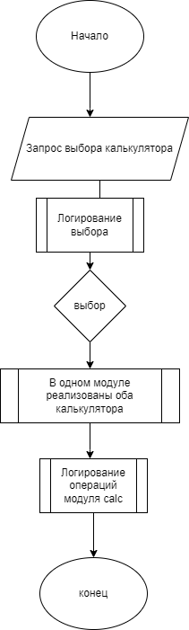

# Задание
Задание в группах(доделать): Создать калькулятор для работы с рациональными и комплексными числами, организовать меню, добавив в неё систему логирования.
Доп задание на следующий семинар(создать структуру и распределить обязанности): Создать телефонный справочник с возможностью импорта и экспорта данных в нескольких форматах.

# Работа с комплексными числами  
За блок отвечал Семенов Евгений (talestro)
, запускается модуль , который будет называться calc, в этом модуле, содержится функция calc_complex(). На вход ничего не принимает, ввод переменных происходит в функции,  выводит строку : первое число, второе число, опреация и результат.
# Работа с рациональными числами.
За блок отвечал Семенов Евгений (talestro)
, запускается модуль , который будет называться calc, в этом модуле, содержится функция calc_ration(). На вход ничего не принимает, ввод переменных происходит в функции,  выводит строку : первое число, второе число, опреация и результат.
# Логирование.
За блок отвечала Осипова Инна + стартовое меню.
Определяется дата и время операции, открывается файл, записывается текст, закрывается файл. Этот модуль принимает на вход какой-то текст. Называься модуль будет log, содержит функцию add_log(text)